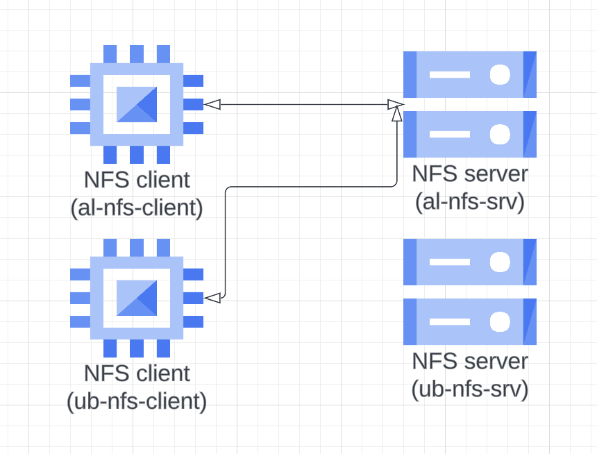

### Creation of Ansible roles for NFS-Server and NFS-Client

Для наглядности использовал несколько хостов, с разными дистрибутивами Linux(AlmaLinux, Ubuntu) 

4 хоста:
2 под серверную часть
2 под клиенткую 

1. **Роль nfs-srv:**
Подготоваливает выделенный жесткий диск для использование впоследствии на нем NFS шары, настраивает LVM, загружает конфиги для экспорта(exports) и запускает службу NFS

2. **Роль nfs-client:**
Устанавливает необходимые пакеты для возможности монтирования nfs, загружает шаблоны systemd юнитов(mount, automount) и подключается к одному из nfs серверов.

Как итог получаем следующую инфраструктуру:

Второй NFS сервер использовался только для наглядности и оптимизации роли для использования на разных дистрибутивах.